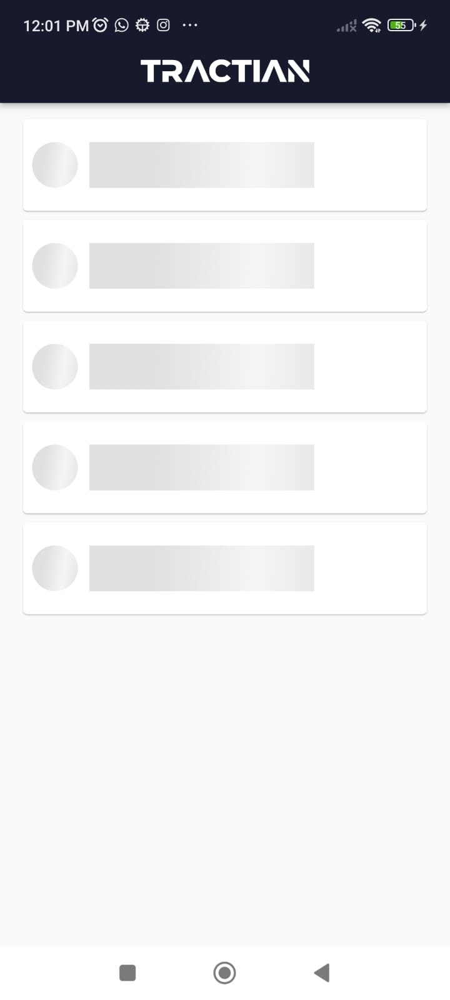
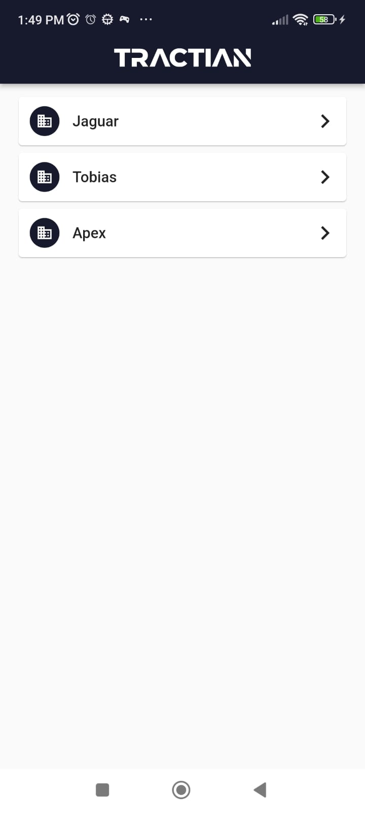
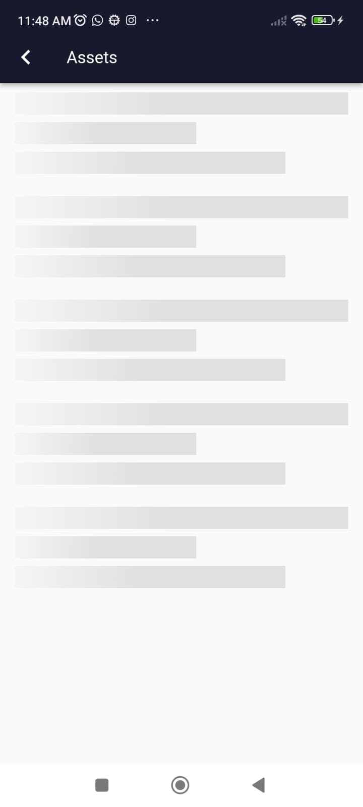
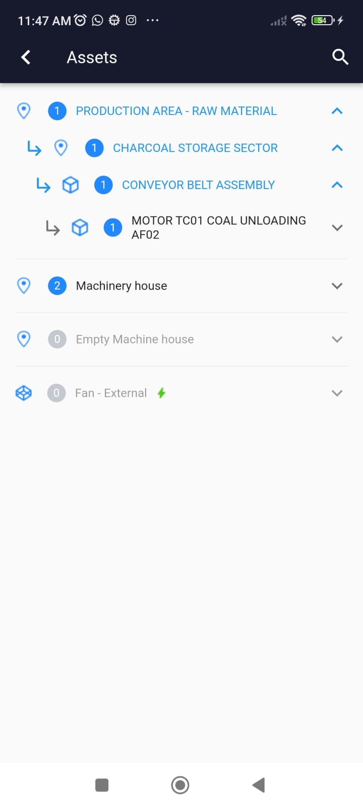
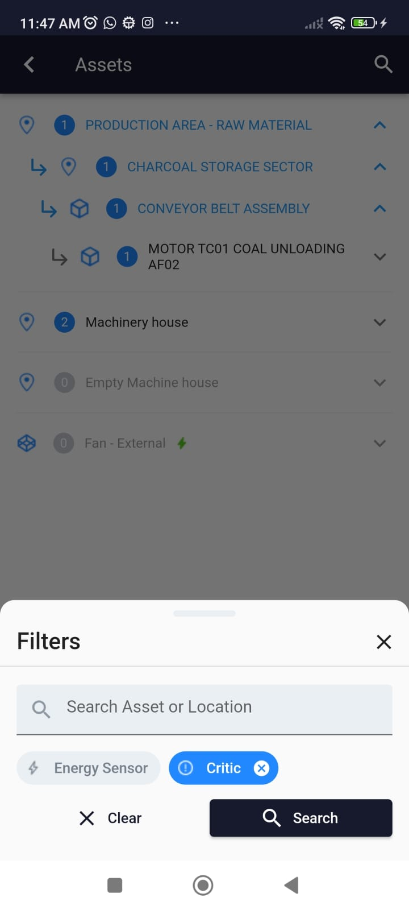

<h1 align="center">Tractian Challenge</h1>

## :iphone: Sobre o projeto

Este app faz parte do [desafio técnico mobile da Tractian](https://github.com/tractian/challenges/tree/main/mobile). Tendo como principais funcionalidades:

- Listagem de Empresas;
- Visualização dos Assets em Árvore;
- Filtro em assets.

O app foi projetado seguindo o padrao arquitetural clean architecture.

Obs.: Tomei a liberdade para fazer modificações no Design System do app, porém as funcionalidades são as mesmas.

## :camera: Prints

#### companies

  
  

#### assets

  
  
  

## 🎥 Fluxo do aplicativo

<video width="320" height="240" controls>
  <source src="assets/readme/apresentation.mp4" type="video/mp4">
</video>

## :rocket: Pacotes utilizados

- [GetIt](https://pub.dev/packages/get_it)
- [Shimmer](https://pub.dev/packages/shimmer)
- [Flutter svg](https://pub.dev/packages/flutter_svg)
- [Flutter bloc](https://pub.dev/packages/flutter_bloc)
- [Bloc](https://pub.dev/packages/bloc)
- [Equatable](https://pub.dev/packages/equatable)
- [Dartz](https://pub.dev/packages/dartz)
- [Intl](https://pub.dev/packages/intl)
- [Dio](https://pub.dev/packages/dio)
- [Pretty dio logger](https://pub.dev/packages/pretty_dio_logger)

## :computer: Como executar

```bash
# Clone Repositorio
$ git clone https://github.com/CastroClucas81/tractian_test.git

# Instale as dependências
$ flutter pub get

# Rode a aplicação
$ flutter run
```

## :page_facing_up: Licença

This project is under the [MIT License](./LICENSE)

Made by Lucas Cardoso de Castro.
